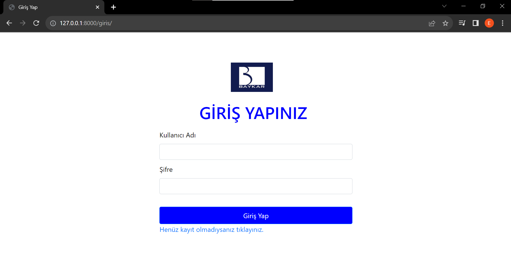

# iha_kiralama

Uygulamada bulunan ekranlar ve özellikleri:  
**1- Giriş Ekranı**  

**2- Kayıt Ol Ekranı**  
**3- Ana Ekran:** Kullanıcının, insansız hava araçlarınının resim ve isimlerinin yer aldığı ekrandır. Kullanıcı eğer isterse her bir iha'nın altında bulunan "detaylı bilgi" butonuna tıklayarak daha çok bilgi edinebileceği bir sayfaya yönlendirilir. 
**4- Profil Sayfam:** Kullanıcı giriş yaptıktan sonra bu ekrana yönlendirilir. Bu ekranda kullanıcının iha kiralayabilmesi için bir buton ve kiralamak için listesine eklediği iha'ların görselleri ve kiralama bilgileri ile birlikte listelendiği "Kiralananlar" bölümü yer almaktadır. Kullanıcı altta yer alan "Iha ekle" butonuna bastığında Kiralayacağı iha'ları seçebileceği bir kiralama ekranına yönlendirilir.  
**5-IHA Kiralama** Bu sayfada kullanıcı kiralamak istediği iha'nın görselinin altında yer alan "detaylı bilgi" veya "kirala" butonlarını kullanarak işlemlerini gerçekleştirebilir.
**6- Admin Paneli** Url'e admin/ yazılarak giriş yapılabilmektedir. Bu ekrandan mevcut kullanıcılar, iha'lar ve kiralama bilgilerinin yer aldığı ayrı ayrı bulunan ilişkisel veritabanı tablolarına ulaşılabilir. Admin veriler üzerinde ekle sil ve güncelle işlemlerini bu paneli kullanarak gerçekleştirebilir.    

